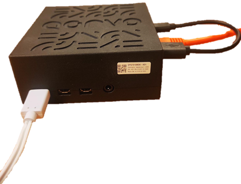
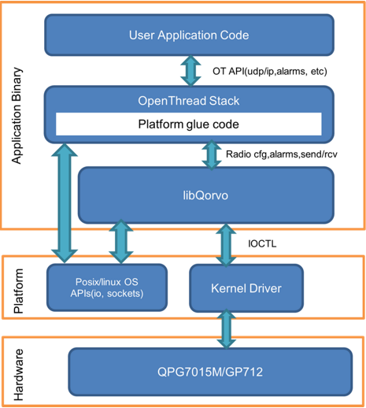
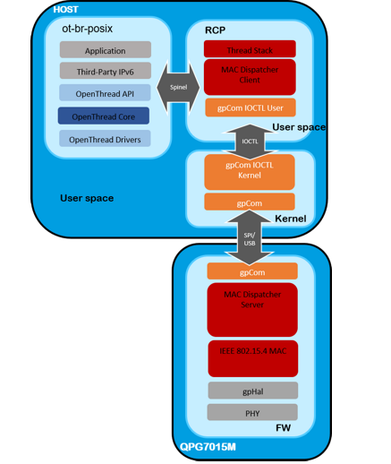

# QPG7015M User Manual

*OpenThread* is an open source implementation of Thread networking protocols developed by the Thread group. It allows IEEE 802.15.4-capable devices to build robust dynamic mesh networks.
This document provides the reader with instructions on how to run a Thread application using the *OpenThread* stack with the QPG7015M.

The QPG7015M ([specification](https://www.qorvo.com/products/p/QPG7015M)) is an IEEE 802.15.4 / Bluetooth® Low Energy Multi-Protocol Multi-Channel Communications Controller for ultra-low power wireless communications for gateways, Smart speakers, Zigbee®/Thread nodes and other Smart Home devices, featuring Qorvo’s ConcurrentConnect™ technology. For IEEE 802.15.4 communications, antenna diversity offers additional robustness in a crowded wireless 2.4 GHz environment. The integrated Power Amplifier (PA) delivers transmit power up to +20 dBm for extended range.
ConcurrentConnect™ technology: allowing instantaneous switching between Bluetooth Low Energy and IEEE 802.15.4 protocols with no observable blind spots.

<div align="center">
  
</div>

---

- [QPG7015M User Manual](#qpg7015m-user-manual)
  - [Prerequisites](#prerequisites)
    - [Hardware](#hardware)
    - [Software](#software)
  - [Building *OpenThread*](#building-openthread)
    - [Architecture](#architecture)
    - [Getting Qorvo *OpenThread*](#getting-qorvo-openthread)
    - [Radio Co-Processor and Command-Line Interface build for QPG7015M](#radio-co-processor-and-command-line-interface-build-for-qpg7015M)
      - [Using buildall.sh script](#using-buildallsh-script)
      - [Build steps](#build-steps)
        - [Building libQorvo](#building-libqorvo)
        - [Building RCP and CLI](#building-rcp-and-cli)
    - [Programming the QPG7015M](#programming-the-qpg7015M)
    - [Interacting with the Thread Network through the CLI](#interacting-with-the-thread-network-through-the-cli)
    - [Building libQorvo for Custom Platform](#building-libqorvo-for-custom-platform)
      - [Customizing Compiler Settings](#customizing-compiler-settings)
  - [Building _OpenThread_ Border Router](#building-openthread-border-router)
  - [Additional resources](#additional-resources)

---

## Prerequisites

### Hardware

The QPG7015M Development Kit contains a Raspberry Pi 4 (RPi), a QPG7015M module and an SD card with the necessary drivers.

### Software

Currently *OpenThread* can only be built using a Unix based system. In this manual we will use a *Debian* based environment (as does *OpenThread*)

Make sure the package repositories are up date

```shell
    sudo apt-get update
```

Ensure that *Git* is installed

```shell
    sudo apt-get install git -y
```

Cross compiler toolchain for Raspberry Pi is available as _Git Submodule_

```shell
    [submodule "ThirdParty/tool_rpi"]
        path = ThirdParty/tool_rpi
        url = https://github.com/raspberrypi/tools.git
```

## Building _OpenThread_

### Architecture

Running Thread on a QPG7015M is split into two major blocks: the *Host* and the QPG7015M firmware. The latter is preprogrammed and requires no user interaction.

<div align="center">
  
</div>

From top to bottom:

> **WARNING:**  paths are relative to the QGateway repository

- The Application:
  - location: `ThirdParty/openthread/examples/apps`
  - what: For this example, the *OpenThread CLI* application will be built. This application allows the manipulation of the Thread stack over a serial interface.
- OpenThread Stack:
  This block can be further split into three blocks (also top-down)
  - Thread
    - location: `ThirdParty/openthread/src`
    - what: implements the [Thread specification](https://www.threadgroup.org/ThreadSpec). It can be configured through a set of [configure switches](https://github.com/openthread/openthread/tree/master/examples/common-switches.mk).
  - Platform glue code:
    - location: `Software/OpenThread/src/qpg7015m`
    - what: code to interface *OpenThread* with platform specific things such as alarms, storage, random number generator, …
  - Drivers and platform interfaces
    The _libQorvo_ library implements platform specific functionality and abstracts OpenThread from the Operating System (OS) and hardware. It provides timers, random and radio APIs in a way the OpenThread platform glue code can use it.
    On the bottom side, it uses a Posix API to interact with OS and Kernel Driver via IOCTL to interact with radio hardware.
    - location: `Software/OpenThread/src/qpg7015m/GP_P1053_SW_15655_Smart_Home_Gateway_OpenThread_Lib_QPG7015M`
    - what: Qorvo specific code, MAC Dispatcher client and libraries required to build for and interface with the QPG7015M kernel drivers.
      specifically (relative to *location*):
      - `Software/OpenThread/library/qpg7015m/lib/libQorvoQPG7015M_ftd.a`: library for *Full Thread Device* support
- Kernel drivers
  - Driver `.ko` files, the necessary deploy instruction and other documentation need to be obtained through <LPW.support@qorvo.com> or through your business contact.

All the parts in _User space_ will be compiled into a single executable `.elf` file. This executable communicates with the RPi kernel drivers provided in the QPG7015M Development Kit.

To obtain the Development Kit and associated drivers contact us at <LPW.support@qorvo.com> or through your business contact.

### Getting Qorvo _OpenThread_

First get the latest version of *QGateway* and its submodules

```shell
    git clone https://github.com/Qorvo/QGateway/tree/v1.5.0.0/QGateway.git
    cd QGateway
    git submodule update --init --recursive
```

The `git submodule update` command will populate the `ThirdParty` directories.

All commands and scripts are run from the `Software/OpenThread` directory.

To resolve any outstanding dependencies to build *OpenThread*, run the optional

```shell
    ./script/bootstrap
```

> **WARNING:** The script will install a _gnu embedded toolchain_, but the one in [Prerequisites](#prerequisites) will be used in this example.
> **WARNING:** The final step of this script will fail if _Linuxbrew_ is not installed. The error can be ignored.

### Radio Co-Processor and Command-Line Interface build for QPG7015M

This is the most common build. It enables the user to control the thread stack parameters, to join/commission devices, etc. by connecting to a Command Line Interface (CLI) server.

> **WARNING:** This guide will cross compile for the Raspberry Pi. It is possible to make the builds natively on a Raspberry Pi, but we found the cross compilation to be faster.

#### Using buildall.sh script

`Software/OpenThread/buildall.sh` implements build steps described below and can be used to build `qpg7015m-ot-cli-ftd.elf` and `qpg7015m-ot-rcp.elf` with:

```shell
     cd Software/OpenThread
     buildall.sh -5
```

> **WARNING:** `buildall.sh` without command line parameter (-G or -5) will build cli and rcp application for all supported platforms currently GP712 and QPG7015M.

#### Build steps

##### Building libQorvo

Sources and makefiles to build `libQorvo` are available under `Software/OpenThread/src/qpg7015m/GP_P1053_SW_15655_Smart_Home_Gateway_OpenThread_Lib_QPG7015M` and can be built as:

```shell
    cd Software/OpenThread/src/qpg7015m/GP_P1053_SW_15655_Smart_Home_Gateway_OpenThread_Lib_QPG7015M/Software
    ./build.sh
```

If everything is configured correctly, build script will generate a library files at (paths are relative to `build.sh` location):

- `OpenThread_Lib_QPG7015M/Work/OpenThreadQorvoGlue_qpg7015m_ftd/libOpenThreadQorvoGlue_qpg7015m_ftd.a`
- `OpenThread_Lib_QPG7015M/Work/OpenThreadQorvoGlue_qpg7015m_mtd/libOpenThreadQorvoGlue_qpg7015m_mtd.a`
- `OpenThread_Lib_QPG7015M/Work/QorvoQPG7015M_rpi/libQorvoQPG7015M_rpi.a`
- `OpenThread_Lib_QPG7015M/Work/QorvoQPG7015M_rpi_cli_ftd_socket/libQorvoQPG7015M_rpi_cli_ftd_socket.a`
- `OpenThread_Lib_QPG7015M/Work/QorvoQPG7015M_rpi_cli_mtd_socket/libQorvoQPG7015M_rpi_cli_mtd_socket.a`

Compiler for `build.sh` and underlying makefiles can be configured by setting system environment variables.

Here is example from `buildall.sh` and more details can be found in [Customizing Compiler Settings](#customizing-compiler-settings).

```shell
    export TOOLCHAIN_RPI="<path-to-QGateway>/ThirdParty/tool_rpi/arm-bcm2708/arm-linux-gnueabihf)"
    export TOOLCHAIN="${TOOLCHAIN_RPI}"
    export CROSS_COMPILE="arm-linux-gnueabihf-"
    export SYSTEMROOT="${TOOLCHAIN}/arm-linux-gnueabihf/sysroot"
```

When compiler is configured, libraries can be also built by running makefiles that are included in the libQorvo source package:

`GP_P1053_SW_15655_Smart_Home_Gateway_OpenThread_Lib_QPG7015M/Software/OpenThread_Lib_QPG7015M`

```shell
    make –f Makefile.QorvoQPG7015M_rpi_cli_mtd_socket
    make –f Makefile.QorvoQPG7015M_rpi_cli_ftd_socket
    make –f Makefile.QorvoQPG7015M_rpi
    make –f Makefile.OpenThreadQorvoGlue_qpg7015m_mtd
    make –f Makefile.OpenThreadQorvoGlue_qpg7015m_ftd
```

**Note 1:** Both _Full Thread Device_ and _Minimal Thread Device_ library, are provided although FTD is more likely scenario in a gateway context the one used in `buildall.sh`. Difference is that FTD library supports Commissioner role while MTD library does not.
**Note 2:** Two library version of libQorvo is also provided where libQorvo is split into QorvoGlue MTD and FTD representing platform independent code and in this use case platform specific rpi library.

##### Building RCP and CLI

Add the compiler to `$PATH`

```shell
    export PATH=<path-to-QGateway>/ThirdParty/tool_rpi/arm-bcm2708/arm-linux-gnueabihf/bin/:$PATH
```

Copy library generated in [Building libQorvo](#building-libqorvo)  step to `Software/OpenThread/library/qpg7015m/lib/libQorvoQPG7015M_ftd.a`

```shell
    cd Software/OpenThread
    cp ./src/qpg7015m/GP_P1053_SW_15655_Smart_Home_Gateway_OpenThread_Lib_QPG7015M/Software/OpenThread_Lib_QPG7015M/Work/QorvoQPG7015M_rpi_cli_ftd_socket/libQorvoQPG7015M_rpi_cli_ftd_socket.a ./library/qpg7015m/lib/libQorvoQPG7015M_ftd.a
```

The basic build command for the QPG7015M is:

```shell
    ./script/build qpg7015m
```
This will build the CLI application for both the *Minimal Thread Device* and the *Full Thread Device* simultaneously. The output will be the following `.elf` files located in `./build/bin`

- `qpg7015m-ot-cli-ftd.elf`
- `qpg7015m-ot-cli-mtd.elf`

*OpenThread* provides a series of configuration switches to enable additional functionality in the build. For a list of the regular and the advanced features we refer you to [common-switches.mk](https://github.com/openthread/openthread/tree/master/examples/common-switches.mk) and the enhanced feature menu on the [build instructions landing page](https://openthread.io/guides/build), respectively.

Note that the Raspberry pi binaries available in the QPG7015M DK have both commissioner and joiner functionality built-in since they are built with:

```shell
    ./script/build qpg7015m -DOT_MTD=0 -DOT_COMMISSIONER=1 -DOT_JOINER=1 -DOT_DHCP6_CLIENT=1 -DOT_DHCP6_SERVER=1
```

The resulting executables can be found in `build/bin`:

- `qpg7015m-ot-cli-ftd.elf`
- `qpg7015m-ot-rcp.elf`

### Programming the QPG7015M

Programming the executable, means just copying it to a RPi and making sure it is executable.

```shell
    chmod +x qpg7015m-ot-cli-ftd.elf
```

To run it, one first has to make sure the kernel drivers are loaded and have a communications channel with the `*.elf`. Instructions for this come with the QPG7015M Development Kit.

### Interacting with the Thread Network through the CLI

Run the executable

```shell
    ./qpg7015m-ot-cli-ftd.elf
```

This launches the CLI client.

Validating the Thread operation can be done by running the scenarios [here](../Guides/thread_validation.md).

### Building libQorvo for Custom Platform

The OpenThread implementation provides network stack source and platform-independent APIs to build applications on top of it. Device-specific code is separated from platform libraries such as libQorvo. The Qorvo OpenThread package provides following components:

- libQorvo sources for building on the target platform including needed components
- Makefile with buildflags
- Toolchain defines for make

#### Customizing Compiler Settings

Toolchain path and settings can be configured by editing Makefiles in `Software/OpenThread/src/qpg7015m/GP_P1053_SW_15655_Smart_Home_Gateway_OpenThread_Lib_QPG7015M/Software/OpenThread_Lib_QPG7015M` directory. Target compiler can be selected by editing `COMPILER` variable in Makefile, i.e. `COMPILER:=rpi_bcm2708` will use `Software/OpenThread/src/qpg7015m/GP_P1053_SW_15655_Smart_Home_Gateway_OpenThread_Lib_QPG7015M/Software/OpenThread_Lib_QPG7015M/make/compilers/rpi_bcm2708/compiler_defines.mk`

Basic `compiler_defines.mk` toolchain
configuration includes:

Path to toolchain root:

```shell
    TOOLCHAIN ?=$(ROOTDIR)/gpHub/TOOL_RPi/bin/arm-gcc-4.7.1
```

Architecture name:

```shell
    ARCH ?=arm
```

Toolchain prefix:

```shell
    CROSS_COMPILE ?=$(ARCH)-bcm2708hardfp-linux-gnueabi-
```

System root definition:

```shell
    SYSTEMROOT ?=$(TOOLCHAIN)/arm-bcm2708hardfp-linux-gnueabi/sysroot
```

Default compiler flags:

```shell
    FLAGS_COMPILER += -Os
    FLAGS_COMPILER += -march=armv6j
    FLAGS_COMPILER += -Wall
```

C compiler flags:

```shell
    CFLAGS_COMPILER += $(FLAGS_COMPILER_FILTERED)
```

C++ compiler flags:

```shell
    CXXFLAGS_COMPILER += $(FLAGS_COMPILER_FILTERED)
    CXXFLAGS_COMPILER +=-Wno-reorder
```

Flags for assembler:

```shell
    ASFLAGS_COMPILER+=
```

Linker options:

```shell
    LDFLAGS_COMPILER+=--sysroot=$(SYSTEMROOT)
```

Library options:

```shell
    LIBFLAGS_COMPILER+=
```

## Building _OpenThread_ Border Router

_OpenThread_ Border Router implementation is not specific for Qorvo or QPG7015M. _OpenThread_ Border Router (`ot-br-posix`) with Radio Co-Processor design will use Spinel protocol to communicate with Radio Co-Processor application (`qpg7015m-ot-rcp.elf`)



For more information about Spinel protocol, see the [Internet-Draft for the Spinel Host-Controller Protocol](https://tools.ietf.org/html/draft-rquattle-spinel-unified).

Building RCP application is previously described in [Radio Co-Processor and Command-Line Interface build for QPG7015M](#radio-co-processor-and-command-line-interface-build-for-qpg7015M)

_OpenThread_ Border Router repository is available as _Git Submodule_

```shell
    [submodule "third_party/ot-br-posix"]
        path = ThirdParty/ot-br-posix
        url = https://github.com/openthread/ot-br-posix.git
```

_OpenThread_ Border Router can be built by following [OpenThread Border Router Build and Configuration](https://openthread.io/guides/border-router/build)

Note that QPG7015M DK is using pre-build docker image from Docker Hub [connectedhomeip/otbr:te7](https://hub.docker.com/layers/connectedhomeip/otbr/te7/images/sha256-4c368e7d5133e66d5d22a30e0b0ce3d48be34bcbdb2eea2bc64bc4399b588f37?context=explore)

And below is an example of creating docker OTBR container from QPG7015M DK.

```shell
    docker create \
      --mount type=bind,source=/home,target=/home \
      --mount type=bind,source=/dev/gp,target=/dev/gp \
      --name otbr_wlan \
      --network host \
      -it \
      -e NAT64=0 \
      --privileged \
      connectedhomeip/otbr:te7 \
      --backbone-interface wlan0 \
      --radio-url spinel+hdlc+forkpty:///home/pi/gateway_20220114-134358-QPG7015M/OpenThread/qpg7015m-ot-rcp.elf
```

_OpenThread_ Border Router can be configured and managed with `ot-ctl` [command line interface](..ThirdParty/openthread/src/cli/README.md).

*OpenThread* Border Router can be also configured with [OpenThread Border Router Web GUI](https://openthread.io/guides/border-router/web-gui).

## Additional resources

Please visit [www.qorvo.com](https://www.qorvo.com) for more information on our product line, or more specifically the [QPG7015M product page](https://www.qorvo.com/products/p/QPG7015M) or contact us at
<LPW.support@qorvo.com>.

Additional generic information can be found on

- <https://github.com/openthread/openthread>
- <https://openthread.io>
- <https://openthread.io/guides/border-router>
- <https://groups.google.com/g/openthread-users>
