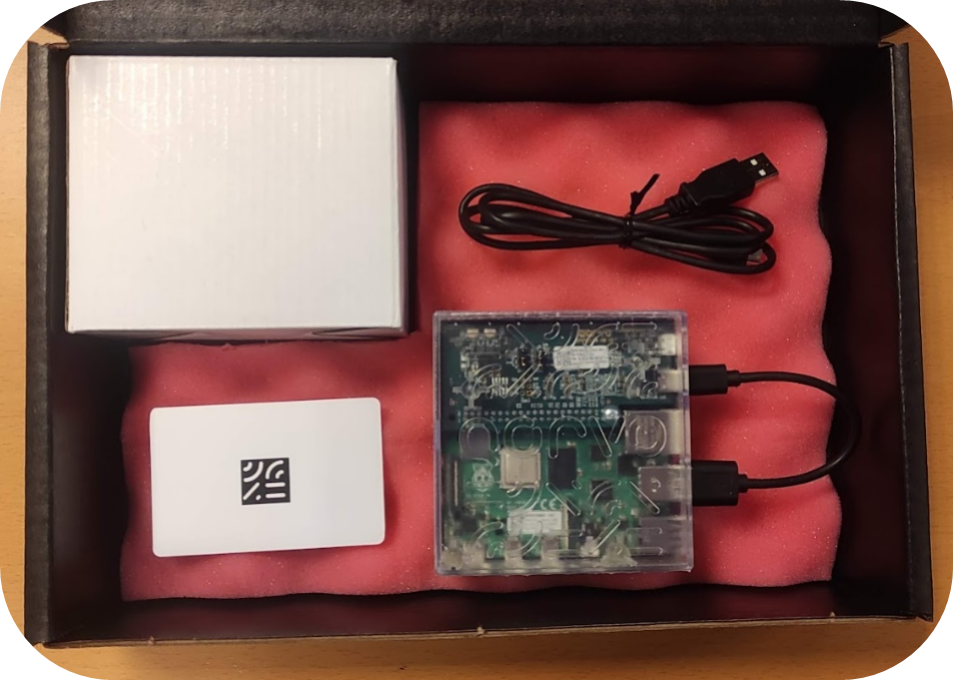

# Congratulations on getting our QPG7015M Development Kit!

:point_right: **Click [here](Documents/Programmer%20Manuals/GP_P1053_UM_17043_Programmer_Manual.pdf) to get started with the QPG7015M Development Kit.** :point_left:

## The QPG7015M Development Kit

The QPG7015M Development Kit shows the functionality on [Qorvo's QPG7015M silicon](https://www.qorvo.com/products/p/QPG7015M).
* Its Product Brief is available [here](Documents/Product%20Briefs/SW100722_SDP006_PB_QPG7015M_Development_Kit.pdf).
* Its Programmer Manual  is available [here](Documents/Programmer%20Manuals/GP_P1053_UM_17043_Programmer_Manual.pdf).
* For more info on its Thread deliverables, check [our Gateway GIT repository](https://github.com/Qorvo/QGateway/).

  

