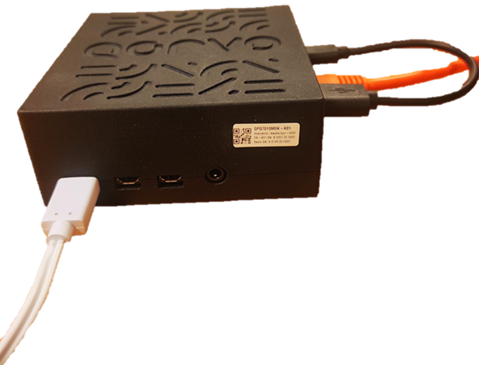
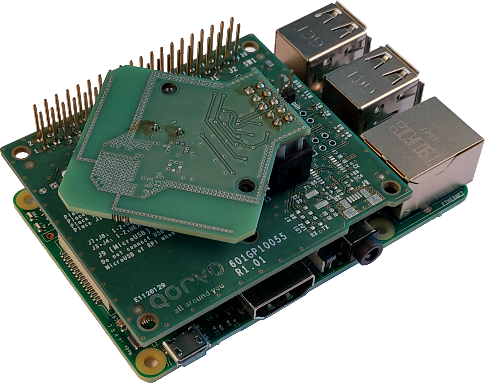
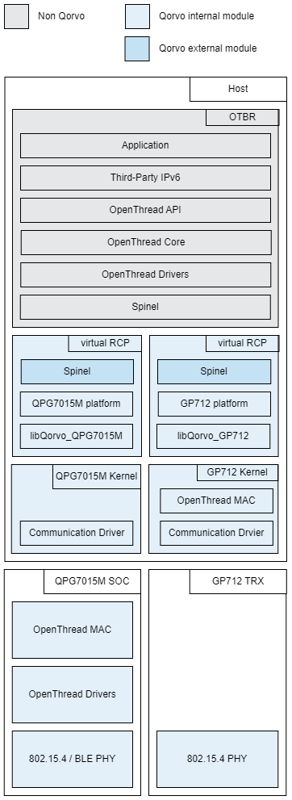
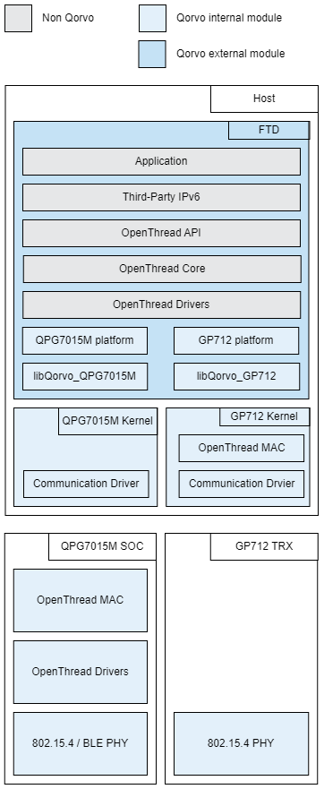

# Qorvo&reg; Smart Home Gateway for QPG7015M and GP712

Welcome to the Qorvo Smart Home Gateway for [Qorvo QPG7015M](https://www.qorvo.com/products/p/QPG7015M) and [Qorvo GP712](https://www.qorvo.com/products/p/GP712) repository! This repository contains the OpenThread software development kit for Qorvo QPG7015M and GP712.

<div align="left">
  
</div>

---
- [Qorvo&reg; Smart Home Gateway for QPG7015M and GP712](#qorvo®-smart-home-gateway-for-qpg7015m-and-gp712)
  - [Introduction](#introduction)
  - [Getting started with the Qorvo Smart Home Gateway SDK for QPG7015M and GP712](#getting-started-with-the-qorvo-smart-home-gateway-sdk-for-qpg7015m-and-gp712)
  - [Installation](#installation)
  - [How to use this repository?](#how-to-use-this-repository)
  - [Folder structure](#folder-structure)
  - [Architecture: Thread Border Router RCP](#architecture-thread-border-router-rcp)
  - [Architecture: Qorvo Full Thread Device](#architecture-qorvo-full-thread-device)
  - [Building and programming the example applications](#building-and-programming-the-example-applications)
    - [Prerequisites](#prerequisites)
    - [Building: Thread Border Router RCP](#building-thread-border-router-rcp)
      - [Build Qorvo virtual RCP](#build-qorvo-virtual-rcp)
      - [Build OTBR docker image](#build-otbr-docker-image)
      - [Create OTBR docker container](#create-otbr-docker-container)
    - [Building: Qorvo Full Thread Device](#building-qorvo-full-thread-device)
      - [Build CLI FTD executables](#build-cli-ftd-executables)
      - [Programming the CLI FTD executables](#programming-the-cli-ftd-executables)
      - [Interacting with the Thread Network through the CLI FTD executables](#interacting-with-the-thread-network-through-the-cli-ftd-executables)
  - [Enable Firmware logging](#enable-firmware-logging)
  - [Debugging the example application](#debugging-the-example-application)
  - [Thread test setup](#thread-test-setup)
    - [Thread Border Router RCP](#thread-border-router-rcp)
    - [Qorvo Full Thread Device](#qorvo-full-thread-device)
  - [Product Test Component](#product-test-component)
  - [Interesting reads](#interesting-reads)
  - [FCC Notice](#fcc-notice)
  - [More information](#more-information)
---

## Introduction

OpenThread is an open-source implementation of the Thread networking protocols developed by the Thread group. It allows IEEE 802.15.4-capable devices to build robust, dynamic mesh networks.
This document provides the reader with instructions on how to run a Thread application using the OpenThread stack with Qorvo QPG7015M and GP712.

To run the examples in this repository, you will need one of the following dev kits:

- Qorvo&reg; IoT Dev Kit Pro

   

  The Qorvo ([QPG7015M](https://www.qorvo.com/products/p/QPG7015M)) is an IEEE 802.15.4 / Bluetooth® Low Energy Multi-Protocol Multi-Channel Communications Controller for ultra-low power wireless communications for gateways, Smart speakers, Zigbee®/Thread nodes, and other Smart Home devices, featuring Qorvo’s ConcurrentConnect™ technology. For IEEE 802.15.4 communications, antenna diversity offers additional robustness in a crowded wireless 2.4 GHz environment. The integrated Power Amplifier (PA) delivers transmit power up to +20 dBm for extended range.ConcurrentConnect™ technology: allowing instantaneous switching between Bluetooth Low Energy and IEEE 802.15.4 protocols with no observable blind spots.

- Qorvo&reg; GP712 Development Kit

   

  The Qorvo ([GP712](https://www.qorvo.com/products/p/GP712)) is an IEEE 802.15.4 multi-stack multi-channel communications controller for integration into a Zigbee® or Thread node. The GP712 interference robustness and antenna diversity offer superior performance in a crowded wireless 2.4 GHz environment.

---

## Getting started with the Qorvo Smart Home Gateway SDK for QPG7015M and GP712

**Matter or Thread Border Router evaluation**

The Qorvo QPG7015M Gateway development kit can be used as an OpenThread Border Router which is a mandatory device for bringing Thread-based Matter nodes into the Matter Network. Instructions to set up a Matter network can be found on [QMatter](https://github.com/Qorvo/QMatter). 

> **WARNING:** This release does not contain a Matter commissioner. Please resort to the CHIP-tool in the open source Matter SDK on GitHub.

**Full Thread Device evaluation**

Set up a Thread network and connect a Thread device to it using the instructions in the [Programmer Manual](Documents/Programmer%20Manuals/GP_P1053_UM_17043_Programmer_Manual.pdf)

---

## Installation

Currently, OpenThread can only be built using a Unix-based system. In this manual, we will use a *Debian-based* environment (as does OpenThread).

---

## How to use this repository?

- Ensure that *Git* is installed

    ```shell
    sudo apt-get update && sudo apt-get install git -y
    ```

- Clone the repository

    To get the latest version of *QGateway* and its submodules, use the following command:

    ```shell
    git clone --recurse-submodules -j8 https://github.com/Qorvo/QGateway.git -b v1.5.2.0
    ```
  - The `--recurse-submodules` option will populate the [ThirdParty](./ThirdParty/) directory with the required submodules.
  - The cross-compiler toolchain for Raspberry Pi is available as _Git Submodule_ at [ThirdParty/tool_rpi](./ThirdParty/tool_rpi/)

- To resolve any outstanding dependencies to build OpenThread, run the optional

  ```shell
  cd Software/OpenThread
  ./script/bootstrap
  ```
  > **WARNING:** The script will install a _gnu embedded toolchain_, but the one in [ThirdParty/tool_rpi](./ThirdParty/tool_rpi/) will be used in this example.

  > **WARNING:** The final step of this script will fail if _Linuxbrew_ is not installed. The error can be ignored.

---

## Folder structure

The Qorvo Smart Home Gateway for the QPG7015M/GP712 repository is structured as follows:

| Folder                                 | Contents                                                                           |
| -------------------------------------- | ---------------------------------------------------------------------------------- |
| **[Documents](Documents/)**     | Comprehensive documentation such as Programmer Manuals, developer guides, API manuals, etc. can be found under this folder. |
| **[Software](Software/)**       | Build tools, Qorvo proprietary software and OpenThread platform code for Qorvo's Thread-capable products|
| **[ThirdParty](ThirdParty/)**   | Submodules used to build and compile deliverables from this SDK |

---

## Architecture: Thread Border Router RCP

<div align="center">
  
</div>

- The Application:
  - Location: Docker Hub or See build instructions below. This architecture runs an OpenThread Border Router in a docker container. It interfaces with Qorvo's virtual RCP node using the Spinel protocol.
- The virtual RCP node:
  - Qorvo provides a virtual RCP node in _user space_ to expose Qorvo's Thread-capable products via the standard Spinel protocol.
  - Location: `Software/OpenThread/src/<platform>` OpenThread Platform Layer which forwards radio specifics to _libQorvo_ and interfaces with the host OS.
  - Location: `Software/OpenThread/src/<platform>/GP_P1053_SW_15655_Smart_Home_Gateway_OpenThread_Lib_<platform>` _libQorvo_ implements platform-specific functionality and abstracts OpenThread from the Operating System (OS) and hardware. It provides timers, random and radio APIs in a way the OpenThread platform glue code can use it.
- Kernel drivers
  - Qorvo's proprietary communication drivers offer a centralized point-of-control of the Thread-capable hardware. It handles full-duplex communication between the communication stacks and configuration applications running simultaneously in the host and Qorvo's hardware. Qorvo offers its unique ConcurrentConnect™ technology to optimize RF performance, which can only be configured using Qorvo's proprietary communication drivers.    

---

## Architecture: Qorvo Full Thread Device

Running Thread on a QPG7015M/GP712 is split into two major blocks: the *Host* and the QPG7015M/GP712 firmware. The latter is preprogrammed and requires no user interaction.

<div align="center">
  
</div>

- The Application:
  - Will be compiled into a single *OpenThread CLI* executable
  - Location: `ThirdParty/openthread/examples/apps` The *OpenThread CLI* application allows the evaluation of a full thread device. 
  - Location: `ThirdParty/openthread/src` The OpenThread Stack Implements the [Thread specification](https://www.threadgroup.org/ThreadSpec). It can be configured through a set of [configure switches](https://github.com/openthread/openthread/tree/master/examples/common-switches.mk). 
  - Location: `Software/OpenThread/src/<platform>` OpenThread Platform Layer which forwards radio specifics to _libQorvo_ and interfaces with the host OS.
  - Location: `Software/OpenThread/src/<platform>/GP_P1053_SW_15655_Smart_Home_Gateway_OpenThread_Lib_<platform>` _libQorvo_ implements platform-specific functionality and abstracts OpenThread from the Operating System (OS) and hardware. It provides timers, random and radio APIs in a way the OpenThread platform glue code can use it.
- Kernel drivers
  - Qorvo's proprietary communication drivers offer a centralized point-of-control of the Thread-capable hardware. It handles full-duplex communication between the communication stacks and configuration applications running simultaneously in the host and Qorvo's hardware. Qorvo offers its unique ConcurrentConnect™ technology to optimize RF performance, which can only be configured using Qorvo's proprietary communication drivers.    

---

## Building and programming the example applications

### Prerequisites

- **Toolchain**

  The cross-compiler toolchain for Raspberry Pi is available as a _Git Submodule_ at [ThirdParty/tool_rpi](./ThirdParty/tool_rpi/).
  > **INFO:** This guide will cross compile for the Raspberry Pi. It is possible to make the builds natively on a Raspberry Pi, but we found the cross compilation to be faster.

- **Obtain Kernel drivers**

  The necessary deploy instructions and other documentation need to be obtained through your business contact.

- **Using buildall.sh script**

    [Software/OpenThread/buildall.sh](./Software/OpenThread/buildall.sh) script automates the process of building OpenThread for QPG7015M and GP712. You can also choose to build for different types: [_(CLI)_](#build-cli-ftd-executables) or [_(RCP)_](#build-qorvo-virtual-rcp), please refer to [build_steps_and_customization.md](build_steps_and_customization.md) for information on the steps used in the `buildall.sh` script and for instructions on building for custom platforms.

  - **Usage**

    - Run the script with the following options:

      ```shell
      cd Software/OpenThread
      ./buildall.sh [options]

      Options:
      --help:                 Display help message and exit.
      --platform <platform>:  Specify the platform to build for: qpg7015m ,gp712, or omit for both.
      --type <type>:          Specify the build type: cli, rcp, or omit for both.
      ```

    - Run the script with no options to build for both platforms and both types
      ```shell
      cd Software/OpenThread
      ./buildall.sh
      ```

### Building: Thread Border Router RCP

#### Build Qorvo virtual RCP

- Build for QPG7015M
    ```shell
    cd Software/OpenThread
    ./buildall.sh --platform qpg7015m --type rcp
    ```
- Build for GP712
    ```shell
    cd Software/OpenThread
    ./buildall.sh --platform gp712 --type rcp
    ```
This will build the RCP applications. The output will be the following `.elf` files located in `Software/OpenThread/build/bin`
  - `qpg7015m-ot-rcp.elf`
  - `gp712-ot-rcp.elf`

#### Build OTBR docker image

The OpenThread Border Router can be built by following [OpenThread Border Router Build and Configuration](https://openthread.io/guides/border-router/build)

Note that the QPG7015M DK is using a docker image built by Qorvo using the following instructions:
This set of instructions will guide you through building an OTBR Docker image `(tested on Raspberry Pi4 running Ubuntu)`.

1. **Clone the OTBR repository:**

    - Clone the OTBR repository using Git.
    ```
    git clone https://github.com/openthread/ot-br-posix.git
    cd ot-br-posix
    ```

1. **Checkout a specific commit:**

    - Check out a specific commit in the repository.  
    `Note: The reason we are checking out this commit is that Qorvo used this commit for Thread certification`
    ```
    git checkout 76bf458d3901b9748abfbc0f0682b6afdcafc3cc
    ```

1. **Initialize submodules:**

    - Initialize and update the project's submodules.
    ```
    git submodule update --init
    ```

1. **Enable TCP in third_party/openthread/CMakeLists.txt:**

    - Change the line **"-DOPENTHREAD_CONFIG_TCP_ENABLE=0"** to **"-DOPENTHREAD_CONFIG_TCP_ENABLE=1"** manually or using the following `sed` command.  
        - The option to enable TCP from a higher level `OT_TCP` was later added in [this commit](https://github.com/openthread/openthread/commit/e3f5bd56a15deccb82dc36c9e84525d2f8527b11) and could be used with the docker build command.
    ```
    sed -i s:'"-DOPENTHREAD_CONFIG_TCP_ENABLE=0"':'"-DOPENTHREAD_CONFIG_TCP_ENABLE=1"':g third_party/openthread/CMakeLists.txt
    ```

1. **Change the mDNSResponder URL in `script/bootstrap` file**

    The reason for this is that Apple has changed the location of their mDNSResponder. This was fixed in a later commit, please see [this commit](https://github.com/openthread/ot-br-posix/commit/22d4f4e488b4f59cd2541ee5b4bee69591053609) for more information.
    ```
    git cherry-pick --no-commit 22d4f4e488b4f59cd2541ee5b4bee69591053609
    ```

1. **Apply the security patch for CVE-2023-2626**

    Please refer to [OpenThread Security](https://github.com/openthread/openthread/security/advisories/GHSA-vr3r-363g-72j9) and [The CVE database](https://cve.report/CVE-2023-2626) for more information.
    ```
    cd third_party/openthread/repo
    git fetch origin main
    git cherry-pick --no-commit 3d5cb364f22f0881d5eb528aea01b8db40cc6dd2
    cd ../../../../ot-br-posix
    ```

1. **Build the docker image:**

    - Build a docker image using specific build arguments.
    ```
    docker build -t qorvo_smarthome_gateway/otbr:ot_76bf458_FIX_TG_CM01 -f etc/docker/Dockerfile . --build-arg REFERENCE_DEVICE=1 --build-arg=OTBR_OPTIONS='-DOT_DNS_CLIENT=ON -DOT_SRP_CLIENT=ON -DOT_LINK_METRICS_INITIATOR=ON'
    ```

#### Create OTBR docker container

Below is an example of creating an OTBR docker container from the QPG7015M DK.

```shell
docker create \
  --mount type=bind,source=/home,target=/home \
  --mount type=bind,source=/dev/gp,target=/dev/gp \
  --name otbr_wlan \
  --network host \
  -it \
  -e NAT64=0 \
  --privileged \
  qorvo_smarthome_gateway/otbr:ot_76bf458_FIX_TG_CM01 \
  --backbone-interface wlan0 \
  --radio-url spinel+hdlc+forkpty:///home/pi//OpenThread/qpg7015m-ot-rcp.elf
```

- The OpenThread Border Router can be configured and managed with `ot-ctl` [command line interface](..ThirdParty/openthread/src/cli/README.md).
- The OpenThread Border Router can be also configured with [OpenThread Border Router Web GUI](https://openthread.io/guides/border-router/web-gui).


### Building: Qorvo Full Thread Device

#### Build CLI FTD executables

This build enables the user to control the thread stack parameters, to join/commission devices, etc. by connecting to a Command Line Interface (CLI) server.

- Build for QPG7015M
    ```shell
    cd Software/OpenThread
    ./buildall.sh --platform qpg7015m --type cli
    ```
- Build for GP712
    ```shell
    cd Software/OpenThread
    ./buildall.sh --platform gp712 --type cli
    ```
This will build the CLI applications for the *Full Thread Device*. The output will be the following `.elf` files located in `Software/OpenThread/build/bin`
  - `qpg7015m-ot-cli-ftd.elf`
  - `gp712-ot-cli-ftd.elf`

#### Programming the CLI FTD executables

Programming the executable means just copying it to a Raspberry Pi and making sure it is executable using the following command.

```shell
chmod +x qpg7015m-ot-cli-ftd.elf
```

To run it, one first has to make sure the kernel drivers are loaded and have a communications channel with the `*.elf`.  
Instructions for this come with the [Qorvo&reg; IoT Dev Kit Pro](#qorvo®-iot-dev-kit-pro).

#### Interacting with the Thread Network through the CLI FTD executables

Run the executable

```shell
./qpg7015m-ot-cli-ftd.elf
```

This launches the CLI client.

Validating the Thread operation can be done by running the scenarios [here](./Documents/Guides/thread_validation.md).

---

## Enable Firmware logging

The Qorvo&reg; IoT Dev Kit Pro comes with two different flavors of the firmware, please refer to [Qorvo&reg; IoT Dev Kit Pro Programmer Manual](Documents/Programmer%20Manuals/GP_P1053_UM_17043_Programmer_Manual.pdf) section `2.1.4 Configure the QPG7015M Gateway` for instructions on how to use the debug firmware version.

---

## Debugging the example application

Please refer to [OpenThread Logs](https://openthread.io/guides/build/logs) for instructions on how to enable OpenThread logs.

---

## Thread test setup

To start evaluating the thread applications, we need at least two nodes:

1. One node acts as a router to form the network, this could either be [Thread Border Router RCP](#thread-border-router-rcp) or [Qorvo Full Thread Device](#qorvo-full-thread-device).

2. One node acts as an end device to join the network, this could be any thread-enabled device like a light bulb or a door switch.
    > **Note:** The Qorvo&reg; IoT Dev Kit Pro could also be used as an end device, please refer to [Qorvo&reg; IoT Dev Kit Pro Programmer Manual](Documents/Programmer%20Manuals/GP_P1053_UM_17043_Programmer_Manual.pdf) section `2.2.7 Thread` for more information.

### Thread Border Router RCP

Instructions to build OpenThread Border Router docker image and Qorvo virtual RCP can be found in the following section: [Building: Thread Border Router RCP](#building-thread-border-router-rcp).

PLease refer to [this guide](Documents/Guides/setup_ot_borderrouter.md) for information on how to setup OpenThread Border Router on Qorvo&reg; IoT Dev Kit Pro. 

### Qorvo Full Thread Device

Instructions to build and use Qorvo Full Thread Device could be found in the following section: [Building: Qorvo Full Thread Device](#building-qorvo-full-thread-device).

The [Qorvo&reg; IoT Dev Kit Pro Programmer Manual](Documents/Programmer%20Manuals/GP_P1053_UM_17043_Programmer_Manual.pdf) section `2.2.7 Thread` showcases an example to form a Thread network using the Thread CLI Application and ping a node in the network.

---

## Product Test Component

`Product Test Component (PTC)` is Qorvo's tool for RF PHY compliance certification and verification and can be used for factory testing. To get started with PTC, please refer to [Qorvo&reg; IoT Dev Kit Pro Programmer Manual](Documents/Programmer%20Manuals/GP_P1053_UM_17043_Programmer_Manual.pdf) section `2.2.3 RF Evaluation (PTC)`

> **NOTE:** When PTC is enabled, the communication stacks are not functional.  
> **NOTE:** The PTC system architecture requires a Windows PC, a host (e.g. raspberry pi) and its connected Qorvo product. The PC will run Radio Control Console (RCC), a CLI application, the host will bridge the RCC application to the firmware running on the Qorvo product (TCP to SPI/USB).

---

## Interesting reads

- [Qorvo&reg; IoT Dev Kit Pro Programmer Manual](Documents/Programmer%20Manuals/GP_P1053_UM_17043_Programmer_Manual.pdf)
- [Setup Qorvo&reg; IoT Dev Kit Pro](Documents/Guides/setup_qpg7015m_dk.md)
- [Setup OpenThread Border Router on Qorvo&reg; IoT Dev Kit Pro](Documents/Guides/setup_ot_borderrouter.md)
- [Thread validation on Qorvo&reg; IoT Dev Kit Pro](Documents/Guides/thread_validation.md)

---

## FCC Notice

This kit is designed to allow:

1. Product developers to evaluate electronic components, circuitry, or software associated with the kit to determine whether to incorporate such items in a finished product and
2. Software developers to write software applications for use with the end product. This kit is not a finished product and when assembled may not be resold or otherwise marketed unless all required FCC equipment authorizations are first obtained. Operation is subject to the condition that this product not cause harmful interference to licensed radio stations and that this product accept harmful interference. Unless the assembled kit is designed to operate under part 15, part 18 or part 95 of this chapter, the operator of the kit must operate under the authority of an FCC license holder or must secure an experimental authorization [under part 5 of this chapter](https://www.govinfo.gov/content/pkg/CFR-2013-title47-vol1/pdf/CFR-2013-title47-vol1-sec2-803.pdf).

---

## More information

Please visit www.qorvo.com for more information on our product line and support options.
